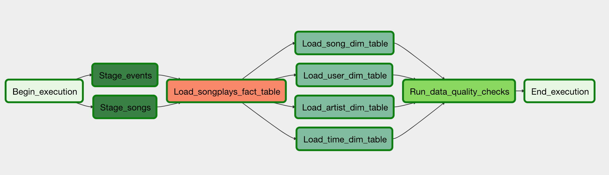

# Data Pipelines with Airflow
A music streaming company, Sparkify, has decided that it is time to introduce more automation and monitoring to their data warehouse ETL pipelines and come to the conclusion that the best tool to achieve this is Apache Airflow.

They have decided to bring you into the project and expect you to create high grade data pipelines that are dynamic and built from reusable tasks, can be monitored, and allow easy backfills. They have also noted that the data quality plays a big part when analyses are executed on top the data warehouse and want to run tests against their datasets after the ETL steps have been executed to catch any discrepancies in the datasets.

The source data resides in S3 and needs to be processed in Sparkify's data warehouse in Amazon Redshift. The source datasets consist of CSV logs that tell about user activity in the application and JSON metadata about the songs the users listen to.

## Data sets
* Log data: `s3://udacity-dend/log_data`
* Song data: `s3://udacity-dend/song_data`

## Project
* The dag template has all the imports and task templates in place, but the task dependencies have not been set
* The operators folder with operator templates
* A helper class for the SQL transformations

## 1. Configuring the DAG
In the DAG, add default parameters according to these guidelines

* The DAG does not have dependencies on past runs
* On failure, the task are retried 3 times
* Retries happen every 5 minutes
* Catchup is turned off
* Do not email on retry
* In addition, configure the task dependencies so that after the dependencies are set, the graph view follows the flow shown in the image below.

## 2. Building the operators
To complete the project, you need to build four different operators that will stage the data, transform the data, and run checks on data quality.

You can reuse the code from Project 2, but remember to utilize Airflow's built-in functionalities as connections and hooks as much as possible and let Airflow do all the heavy-lifting when it is possible.

All of the operators and task instances will run SQL statements against the Redshift database. However, using parameters wisely will allow you to build flexible, reusable, and configurable operators you can later apply to many kinds of data pipelines with Redshift and with other databases.

### Stage Operator
The stage operator is expected to be able to load any JSON and CSV formatted files from S3 to Amazon Redshift. The operator creates and runs a SQL COPY statement based on the parameters provided. The operator's parameters should specify where in S3 the file is loaded and what is the target table.

The parameters should be used to distinguish between JSON and CSV file. Another important requirement of the stage operator is containing a templated field that allows it to load timestamped files from S3 based on the execution time and run backfills.

### Fact and Dimension Operators
With dimension and fact operators, you can utilize the provided SQL helper class to run data transformations. Most of the logic is within the SQL transformations and the operator is expected to take as input a SQL statement and target database on which to run the query against. You can also define a target table that will contain the results of the transformation.

Dimension loads are often done with the truncate-insert pattern where the target table is emptied before the load. Thus, you could also have a parameter that allows switching between insert modes when loading dimensions. Fact tables are usually so massive that they should only allow append type functionality.

### Data Quality Operator
The final operator to create is the data quality operator, which is used to run checks on the data itself. The operator's main functionality is to receive one or more SQL based test cases along with the expected results and execute the tests. For each the test, the test result and expected result needs to be checked and if there is no match, the operator should raise an exception and the task should retry and fail eventually.

For example one test could be a SQL statement that checks if certain column contains NULL values by counting all the rows that have NULL in the column. We do not want to have any NULLs so expected result would be 0 and the test would compare the SQL statement's outcome to the expected result.

### Note about Workspace
After you have updated the DAG, you will need to run /opt/airflow/start.sh command to start the Airflow web server. Once the Airflow web server is ready, you can access the Airflow UI by clicking on the blue Access Airflow button.

## Specifications

### General

- [ ] **The dag and plugins do not give an error when imported to Airflow**: All tasks have correct dependencies

- [ ] **DAG can be browsed without issues in the Airflow UI**: The dag follows the data flow provided in the instructions, all the tasks have a dependency and DAG begins with a start_execution task and ends with a end_execution task.

### DAG Configuration

- [ ] **Default_args object is used in the DAG**: DAG contains default_args dict, with the following keys:

    - Owner
    - Depends_on_past
    - Start_date
    - Retries
    - Retry_delay
    - Catchup

- [ ] **Defaults_args are bind to the DAG**: The DAG object has default args set

- [ ] **The DAG has a correct schedule**: The DAG should be scheduled to run once an hour

### Staging the data

- [ ] **Task to stage CSV and JSON data is included in the DAG and uses the RedshiftStage operator**: There is a task that to stages data from S3 to Redshift. (Runs a Redshift copy statement)

- [ ] **Task uses params**: Instead of running a static SQL statement to stage the data, the task uses params to generate the copy statement dynamically

- [ ] **Logging used**: The operator contains logging in different steps of the execution

- [ ] **The database connection is created by using a hook and a connection**: The SQL statements are executed by using a Airflow hook

### Loading dimensions and facts

- [ ] **Set of tasks using the dimension load operator is in the DAG**: Dimensions are loaded with on the LoadDimension operator

- [ ] **A task using the fact load operator is in the DAG**: Facts are loaded with on the LoadFact operator

- [ ] **Both operators use params**: Instead of running a static SQL statement to stage the data, the task uses params to generate the copy statement dynamically

- [ ] **The dimension task contains a param to allow switch between append and insert-delete functionality**: The DAG allows to switch between append-only and delete-load functionality

### Data Quality Checks

- [ ] **A task using the data quality operator is in the DAG and at least one data quality check is don**e: Data quality check is done with correct operator

- [ ] **The operator raises an error if the check fails pass**: The DAG either fails or retries n times

- [ ] **The operator is parametrized**: Operator uses params to get the tests and the results, tests are not hard coded to the operator

**Suggestions to Make Your Project Stand Out!**
* Simple and dynamic operators, as little hard coding as possible
* Effective use of parameters in tasks
* Clean formatting of values in SQL strings
* Load dimensions with a subdag