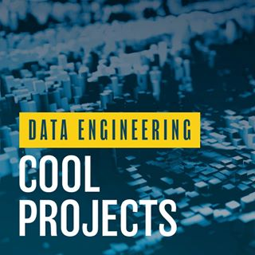

# Data-engineering-nanodegree
Projects done in the [Data Engineering Nanodegree by Udacity.com](https://www.udacity.com/course/data-engineer-nanodegree--nd027)

## Course 1: Data Modeling
### Introduction to Data Modeling
➔ Understand the purpose of data modeling

➔ Identify the strengths and weaknesses of different types of databases and data storage techniques

➔ Create a table in Postgres and Apache Cassandra

### Relational Data Models
➔ Understand when to use a relational database

➔ Understand the difference between OLAP and OLTP databases

➔ Create normalized data tables

➔ Implement denormalized schemas (e.g. STAR, Snowflake)

### NoSQL Data Models
➔ Understand when to use NoSQL databases and how they differ from relational databases

➔ Select the appropriate primary key and clustering columns for a given use case

➔ Create a NoSQL database in Apache Cassandra

#### Project: Data Modeling with Postgres and Apache Cassandra

## Course 2: Cloud Data Warehouses
### Introduction to the Data Warehouses
➔ Understand Data Warehousing architecture

➔ Run an ETL process to denormalize a database (3NF to Star)

➔ Create an OLAP cube from facts and dimensions

➔ Compare columnar vs. row oriented approaches

### Introduction to the Cloud with AWS
➔ Understand cloud computing

➔ Create an AWS account and understand their services

➔ Set up Amazon S3, IAM, VPC, EC2, RDS PostgreSQL

### Implementing Data Warehouses on AWS
➔ Identify components of the Redshift architecture

➔ Run ETL process to extract data from S3 into Redshift

➔ Set up AWS infrastructure using Infrastructure as Code (IaC)

➔ Design an optimized table by selecting the appropriate distribution style and sorting key

#### Project 2: Data Infrastructure on the Cloud

## Course 3: Data Lakes with Spark
### The Power of Spark
➔ Understand the big data ecosystem

➔ Understand when to use Spark and when not to use it

### Data Wrangling with Spark
➔ Manipulate data with SparkSQL and Spark Dataframes

➔ Use Spark for ETL purposes

### Debugging and Optimization
➔ Troubleshoot common errors and optimize their code using the Spark WebUI

### Introduction to Data Lakes
➔ Understand the purpose and evolution of data lakes

➔ Implement data lakes on Amazon S3, EMR, Athena, and Amazon Glue

➔ Use Spark to run ELT processes and analytics on data of diverse sources, structures, and vintages

➔ Understand the components and issues of data lakes

#### Project 3: Big Data with Spark

## Course 4: Automate Data Pipelines
### Data Pipelines
➔ Create data pipelines with Apache Airflow

➔ Set up task dependencies

➔ Create data connections using hooks

### Data Quality
➔ Track data lineage

➔ Set up data pipeline schedules

➔ Partition data to optimize pipelines

➔ Write tests to ensure data quality

➔ Backfill data

### Production Data Pipelines
➔ Build reusable and maintainable pipelines

➔ Build your own Apache Airflow plugins

➔ Implement subDAGs

➔ Set up task boundaries

➔ Monitor data pipelines

#### Project: Data Pipelines with Airflow
